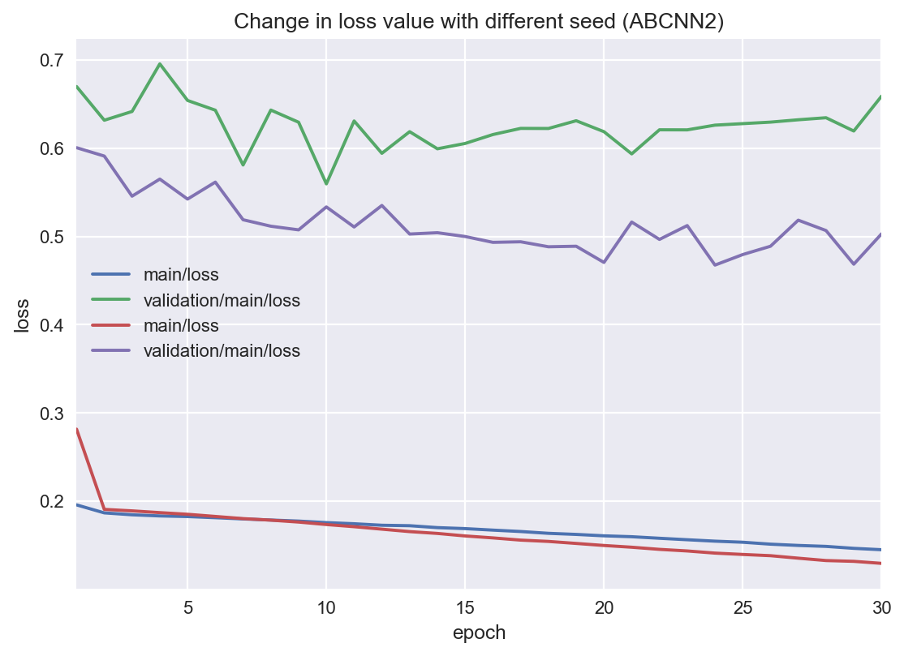
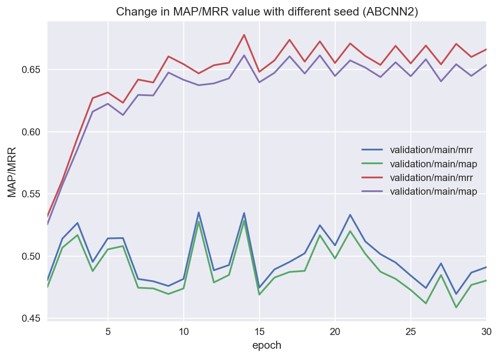

# About
This repository contains re-implementation of `Wenpeng Yin; Hinrich Schütze; Bing Xiang; Bowen Zhou. "ABCNN: Attention-Based Convolutional Neural Network for Modeling Sentence Pairs" TACL 2016` ([PDF](http://aclweb.org/anthology/Q/Q16/Q16-1019.pdf))

In order to assure that the implementation is correct, this repo reports the result for WikiQA task, which is the task used in the original paper.

@losyer gave me some very nice advice about the implementation (mainly about the model difference between the [actual implementation by the author](https://github.com/yinwenpeng/Answer_Selection) and the description provided on paper.)

# WikiQA result
## BCNN
BCNN HyperParameter
- Number of BCNN layer: 1
- Word Embedding: Pretrained word2vec vector from GNews
    - Dimension is 300
- Learning Rate: 0:08
- Optimizer: AdaGrad
- BatchSize: 20
- Weight Decay: 0.0002

Hyperparameters are not tuned very well and the result is not as good as it should be.
It seems that the final performance heavily depends upon the initial weight of the model.

Since the original paper does not report the hyperparameter for BCNN, I don't know whether my implementation is wrong, or it is parameter issue.

|          | MAP    | MRR    |
|----------|--------|--------|
| SVM Dev  | 0.6307 | 0.6349 |
| SVM Test | 0.6165 | 0.6310 |
| LR Dev   | 0.6307 | 0.6349 |
| LR Test  | 0.6330 | 0.6480 |

The parameter of both SVM and LR are default of scikit-learn library.

## ABCNN2
ABCNN2 HyperParameter
- Number of layer: 2
- Word Embedding: Pretrained word2vec vector from GNews
    - Dimension is 300
- Learning Rate: 0.05
- BatchSize: 32
- Optimizer: AdaGrad
- Weight Decay: 0.0003

|               | MAP    | MRR    |
|---------------|--------|--------|
| Softmax Test  | 0.6614 | 0.6779 |
| SVM Test      | 0.6301 | 0.6470 |

(Softmax means the direct prediction of the model, not relying on the external training of SVM/LR)

It seems that my implementation of (A)BCNN is significantly vulnerable to the initial value of paramters of conv. filter, final linear layer and the word embedding.

Here is the change in loss value of the same model (but different seed)

While the validation loss value decreases in one seed, the other one doesn't.

This issue very harmful to the actual performance of the model, as shown below.

The model with the seed value of decreasing validation loss, the model performs very good (although still worse than the score on the paper).
However, the model with the other seed value performs poorly.
The difference is 20 points in maximum, and this result is definitely undesirable.

# ABCNN1 & ABCNN3
These models are implemented on this repo, but there is no experimental results.
