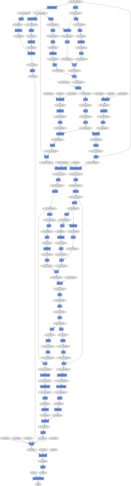

# About
This repository contains re-implementation of `Wenpeng Yin; Hinrich Schütze; Bing Xiang; Bowen Zhou. "ABCNN: Attention-Based Convolutional Neural Network for Modeling Sentence Pairs" TACL 2016` ([PDF](http://aclweb.org/anthology/Q/Q16/Q16-1019.pdf))

In order to assure that the implementation is correct, this repo reports the result for WikiQA task, which is the task used in the original paper.

# Model Overview

# WikiQA result
## BCNN Model
BCNN HyperParameter
- Number of BCNN layer: 1
- Word Embedding: Pretrained word2vec vector from GNews
    - Dimension is 300
- Learning Rate: 0:08
- Optimizer: AdaGrad
- BatchSize: 20
- Weight Decay: 0.0002

Hyperparameters are not tuned very well and the result is not as good as it should be.
It seems that the final performance heavily depends upon the initial weight of the model.

Since the original paper does not report the hyperparameter for BCNN, I don't know whether my implementation is wrong, or it is parameter issue.

|          | MAP    | MRR    |
|----------|--------|--------|
| SVM Dev  | 0.6307 | 0.6349 |
| SVM Test | 0.6165 | 0.6310 |
| LR Dev   | 0.6307 | 0.6349 |
| LR Test  | 0.6330 | 0.6480 |

The parameter of both SVM and LR are default of scikit-learn library.
